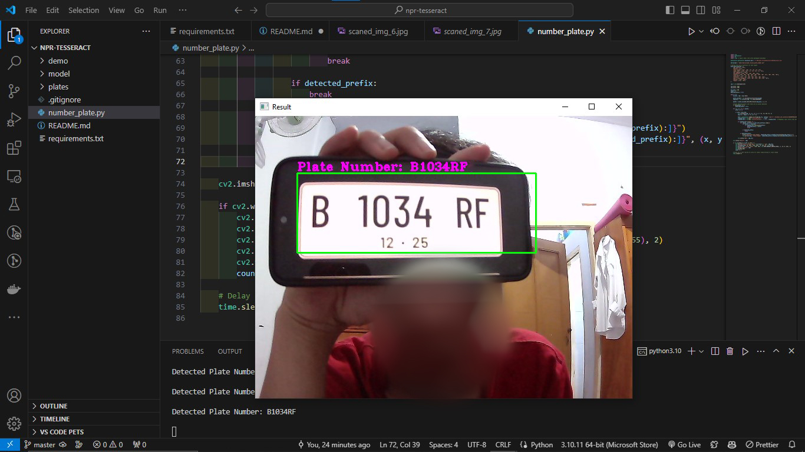

## Number Plate Recognition with Optical Character Recognition

This code is open source

Number Plate Recognition (NPR), also known as Automatic Number Plate Recognition (ANPR) or License Plate Recognition (LPR), is a technology used to automatically detect and recognize vehicle license plates. The system uses an optical camera and character recognition (OCR) software to capture images of license plates from passing vehicles, then analyzes the images to recognize and extract the text contained within.

### Install

**Install on Windows**

Install [Git Bash](https://git-scm.com/downloads), [Python](https://www.python.org/downloads/) and [Tesseract](https://sourceforge.net/projects/tesseract-ocr.mirror/) first

After that, open git bash and follow these commands

```bash
$ git clone https://github.com/JosuaLimbu/npr-tesseract.git
$ cd npr-tesseract
$ pip install -r requirements.txt
$ python3 number_plate.py
```

And the code is ready to use.
The end result will be like this.

